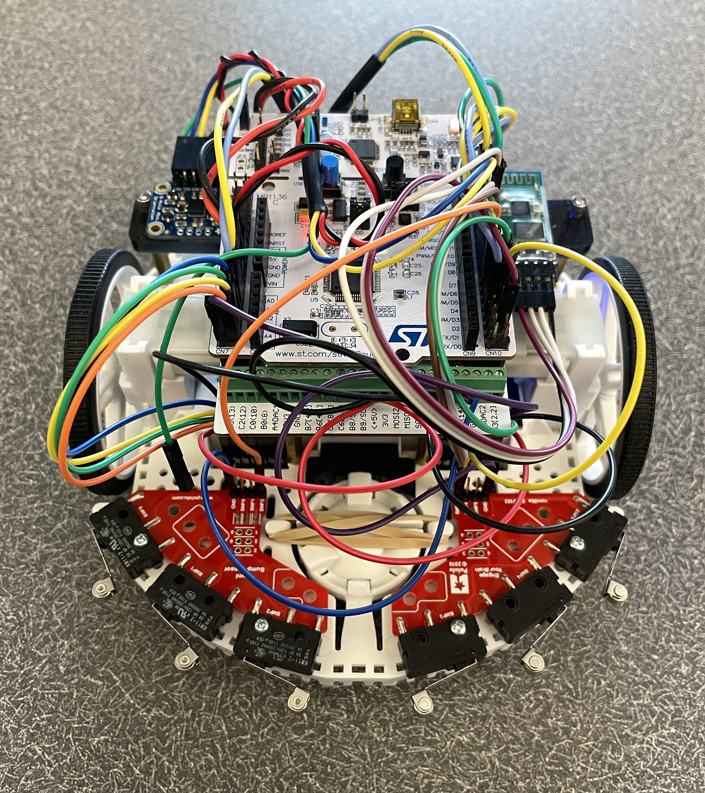
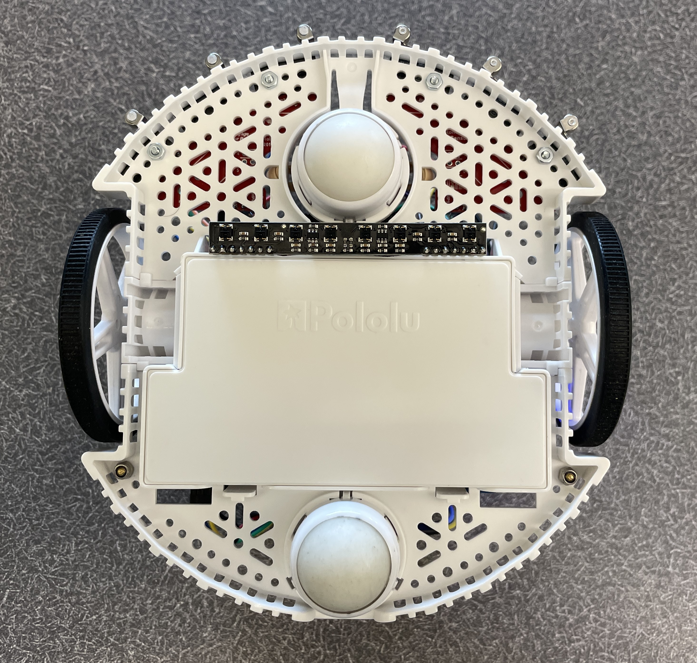
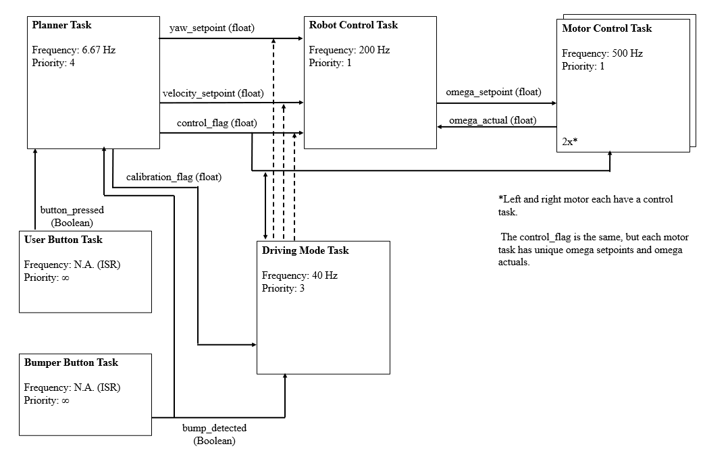
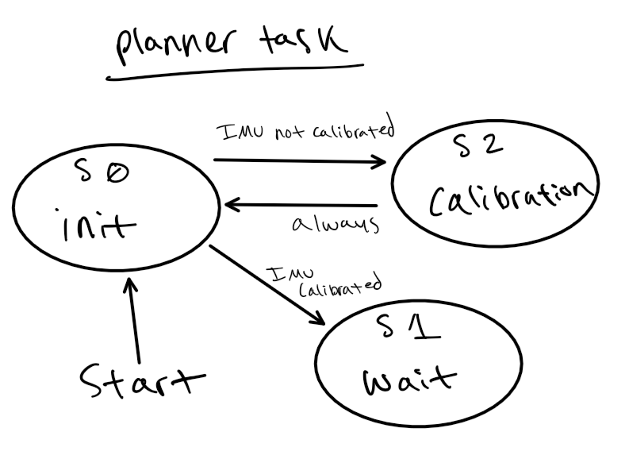
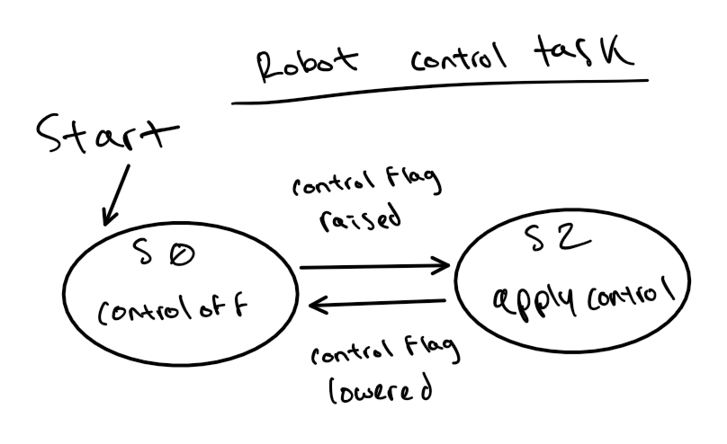
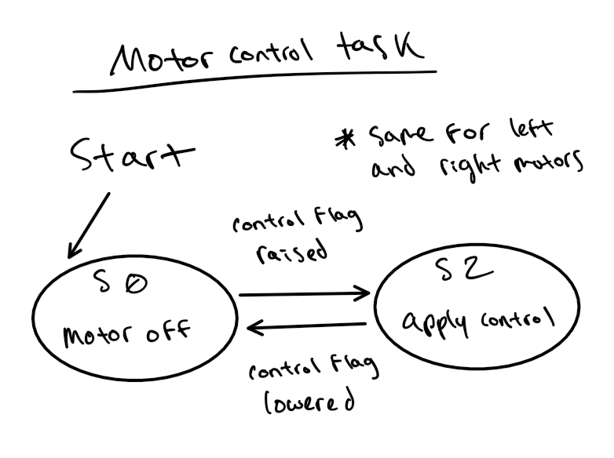
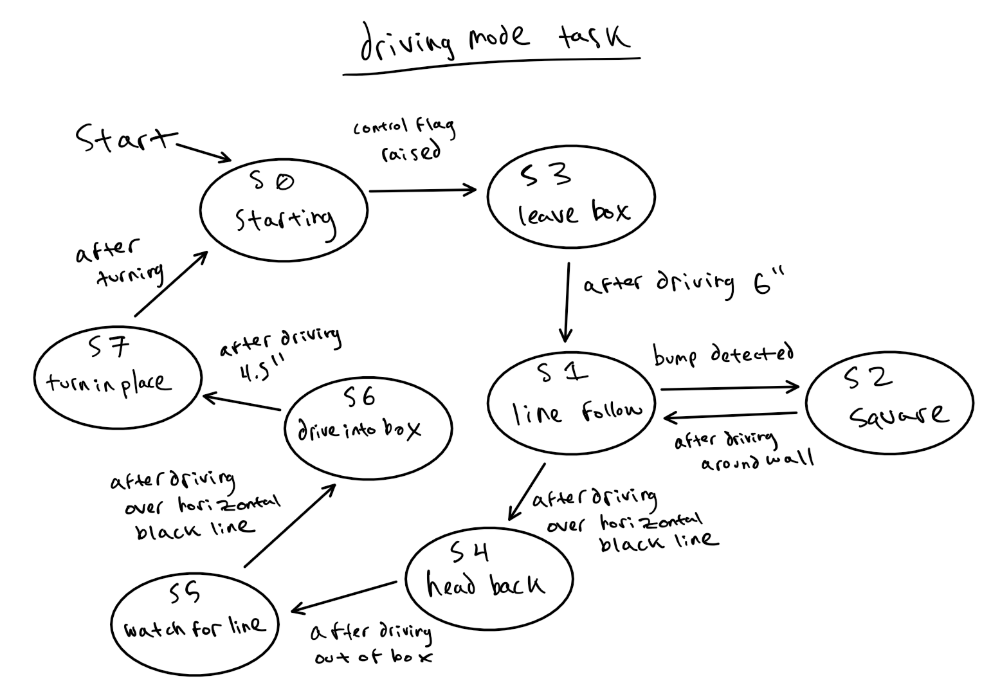
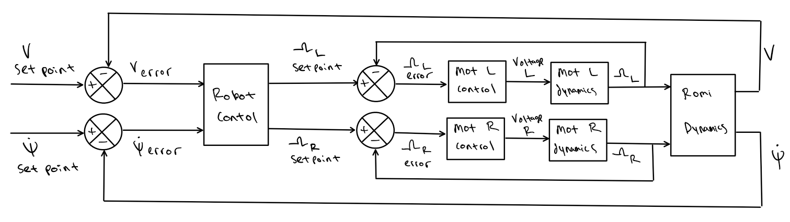
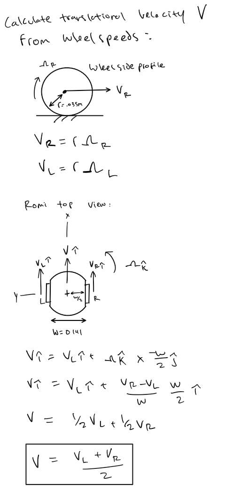
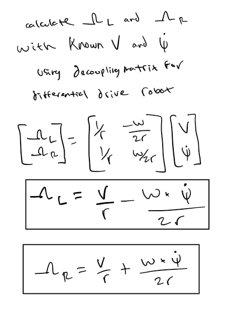

# ME-405-Romi
## Project Overview and Results

**Figure 1:** Finished robot

This is the repository for the Cal Poly ME-405 term project by Colin Bentley and Jack Maxwell that required building and programming a line following differential drive robot. The robot follows a black line from the start box to the finish box and navigates around a wall obstacle along the way. After finishing, the robot drives back to start and prepares for another run. The robot features a line sensor, bump sensors, and a 9-DOF absolute orientation IMU to read heading and yaw. The robot can successfully navigate the course. The line following is accurate, even with challenging shapes like dashes and horizontal lines in the path, and the control system results in smooth driving.

[Watch Romi complete the course](https://cpslo-my.sharepoint.com/:v:/g/personal/cobentle_calpoly_edu/EcgrodB_KnZJpqk-TpCn7YkBvjt-W66TGioHFDayowuLnw?nav=eyJyZWZlcnJhbEluZm8iOnsicmVmZXJyYWxBcHAiOiJTdHJlYW1XZWJBcHAiLCJyZWZlcnJhbFZpZXciOiJTaGFyZURpYWxvZy1MaW5rIiwicmVmZXJyYWxBcHBQbGF0Zm9ybSI6IldlYiIsInJlZmVycmFsTW9kZSI6InZpZXcifX0%3D&e=5IIpsw)

This project has room for future improvements. Currently, the wall navigation parameters have to be preprogrammed. Having the robot slowly bump around the wall similar to a Roomba could make this program more flexible for unknown obstacles while keeping the same bump sensors. The navigation from start to finish relies on the start box being directly behind the robot when it finishes the course. Adding calculations for the robot's postion while running through the course would allow it to drive back to start even if the start and finish boxes were moved. The program could run faster by using an analog line sensor or by configuring the digital sensor to work with interupts to prevent the program from waiting while reading the line. We noticed that battery voltage has a noticable impact on performance, and the control gains should be tuned to the specific voltage for best results.

## Hardware
The robot is built off a Romi chassis and controlled using a Nucleo L476RG running MicroPython. An additional circuit board called the Shoe of Brian attaches to the Nucleo. Information about the shoe and general support for the techniques used in this project can be found [here](https://github.com/spluttflob/ME405-Support).

**Figure 2:** Romi front view with IMU and bluetooth module shown on the sides

The Nucleo attaches to standoffs and an acrylic mount as shown in this [model](https://cad.onshape.com/documents/b78783ff999bc8e6a9990234). The IMU and optional Bluetooth module are taped to the sides of the acrylic mount. The bump sensors screw directly to the front of the chassis, and the line sensor is taped to the line sensor mount which taped to the chassis.

**Figure 3:** Romi bottom view with line sensor

Table 1 lists all of the parts besides the jumper wires used in this project.

**Table 1:** Complete BOM
| Part                           | Supplier  | P/N    | Additional Info                                                                 |
|--------------------------------|-----------|--------|---------------------------------------------------------------------------------|
| Microcontroller                | Nucleo    | L476RG |                                                                                 |
| Shoe of Brian                  | Custom    | N/A    | [OSH Park](https://oshpark.com/shared_projects/e6X6OnYK)                   |
| Romi Chassis Kit               | Pololu    | 3509   |                                                                                 |
| Motor Driver and Power Distribution Board | Pololu | 3543   |                                                                                 |
| Line Sensor                    | Pololu    | 3672   |                                                                                 |
| Right Bumper                   | Pololu    | 3674   |                                                                                 |
| Left Bumper                    | Pololu    | 3673   |                                                                                 |
| IMU                            | Adafruit  | 2472   |                                                                                 |
| Bluetooth Module               |           | HC-05  | Optional                                                                       |
| Line Sensor Mount              | Custom    | N/A    | See line-sensor-mount.STEP                                                         |
| Misc. mounts and fasteners     | N/A       | N/A    | [Onshape](https://cad.onshape.com/documents/b78783ff999bc8e6a9990234)      |

Figure 4 is a wiring diagram for the robot and, Table 2 lists the wire connections used.

**Figure 4:** Wiring diagram

**Table 2:** Wire connections
| Device/Function          | Signal              | Nucleo Pin      | Device Pin |
|--------------------------|---------------------|-----------------|------------|
| Left Encoder (Romi PDB)  | Enc Ch A            | B5 (Tim 3)      | ELA        |
|                          | Enc Ch B            | B4 (Tim 3)      | ELB        |
| Right Encoder (Romi PDB) | Enc Ch A            | A1 (Tim 2)      | ERA        |
|                          | Enc Ch B            | A0 (Tim 2)      | ERB        |
| Left Motor (Romi PDB)    | Enable              | A9              | SLP        |
|                          | Direction           | A8              | DIR        |
|                          | Effort              | B6 (Tim 4)      | PWM        |
| Right Motor (Romi PDB)   | Enable              | C9              | SLP        |
|                          | Direction           | C8              | DIR        |
|                          | Effort              | C6 (Tim 8)      | PWM        |
| Power (Romi PDB)         | Ground              | GND             | GND        |
|                          | Power               | VIN             | VSW        |
| I2C                      | SCL                 | B8              | SCL        |
|                          | SDA                 | B9              | SDA        |
| HC-05 Bluetooth          | RX                  | C4              | RX         |
|                          | TX                  | C5              | TX         |
| Left Bumper              | BMP                 | B14             | BMP 3      |
|                          | GND                 | GND             | GND        |
| Right Bumper             | BMP                 | C7              | BMP 2      |
|                          | GND                 | GND             | GND        |
| Line Sensor              | Power               | 5V              | VIN        |
|                          | GND                 | GND             | GND        |
|                          | Sensor 0            | A4              | S0 (R)     |
|                          | Sensor 1            | B0              | S1         |
|                          | Sensor 2            | C1              | S2         |
|                          | Sensor 3            | A3              | S3         |
|                          | Sensor 4            | A6              | S4         |
|                          | Sensor 5            | B1              | S6         |
|                          | Sensor 7            | C3              | S7 (L)     |

Additionally, the IMU and Bluetooth Module are both wired to +5V and GND for their power supply.

## Code
The code folder contains all of the files that need to be stored on the Nucleo in order to run. This project uses MicroPython, which the nucleo needs to be preconfigured with before adding the other files.

### Task Structure
ADD OVERALL TASK DIAGRAM AND INDIVIDUAL FSMs WITH DISCUSSION SIMILAR TO LAB 3

**Figure 5:** Overall task diagram

The Planner Task in our code is less complex than the other tasks, but is still crucial to the success of the program. In State 0, some system parameters are initialized, and on startup and when the code is reset from the PuTTY REPL, the task switches to State 2 for calibration. Upon successful calibration the task moves to State 1, where you are prompted to press the blue button to begin driving. Pressing the blue button will enable the system control loop and allow the robot to begin moving forward.

**Figure 6:** Planner Task State Transition Diagram

The robot control task is the outer loop of our system control, as seen in Figure 7. In State 1, this task takes in the translational velocity and yaw rate setpoints calculated by the driving mode task, as well as the actual wheel velocities calculated by the motor control task. Using the individual wheel velocities, this task calculates the actual translational velocity, and using the heading data from the IMU, calculates the actual yaw rate of Romi. PI Control (proportional and integral control) is performed on these values to calculate a velocity request and a yaw rate request, which are converted to a left and right wheel speed request, which are then sent to the individual wheel control tasks using shares. In State 0, the timer used to calculate the integral error for integral control is continuously reset to avoid integral error buildup while the control is off.

**Figure 7:** Robot Control Task State Transition Diagram

The motor control tasks act similarly to the overall robot control. They take in the setpoints for wheel velocity calculated by robot control and perform PI control on them to determine the duty cycle percentage that is sent to each motor. The actual velocities are sent to the robot control task when they are measured. Like the robot control, State 0 updates the encoder each pass-through to avoid integral error buildup.

**Figure 8:** Motor Control Task State Transition Diagram

The driving mode task is our most complex task, as it is responsible for keeping the robot on the line and making it drive around the obstacle on the course. State 0 initializes some variables and flagsthat are used throughout the task, and when the system control flag is raised by the planner task, it moves to State 3, which instructs it to drive forward to leave the starting area. Once the robot has left the starting area, State 1 is entered, which is our main line-following state. This state reads the line sensor, and sends a yaw rate request to the system control based on the location of the line relative to the robot. When a bump is detected by the bump sensors mounted to the robot, the task enters State 2, where the robot is given a specific set of instructions to drive around the obstacle on the course, before returning to State 1 for line following.

When the robot enters the finishing area, the task enters State 4, where the robot drives to the center of the finishing area, and turns in place until its heading is 180 degrees past that of its initial heading. It then begins driving straight backwards and enters State 5. In State 5, the robot drives straight backward until it detects the starting area, where the task then enters State 6 to center itself in the box, and finally enters State 7 to turn the robot around and re-initialize the program to prepare for future runs.

**Figure 9:** Driving Mode Task State Transition Diagram

### Control System
Figure 5 depicts the overall control system for the robot. We specify velocity and setpoints for the robot control loop either manually or using feedback from devices like the line sensor. . The robot control calculates the actual translational velocity using wheel speed measurements from the motor tasks and gathers yaw measurements from the IMU. Both are fed through PI control to become velocity and yaw requests. Omega setpoints are calculated from these requests using the robot parameters and sent to each of the motor control tasks. The motor control tasks perform PI control of the left and right wheel speeds using omega setpoints from the robot control and real omega measurements calculated from the encoders.

**Figure 10:** Overall control system

## Supporting Calculations
Figures 11 and 12 show the calculations for translational velocity from the wheel speeds and the angular velocity setpoints from the velocity and yaw setpoints. These calculations are performed in the robot control task.

**Figure 11:** Translational velocity calculation

**Figure 12:** Angular velocity calculation
